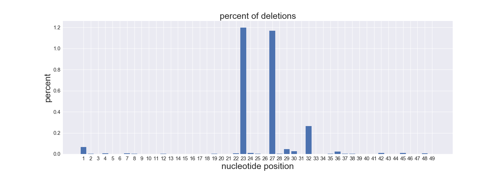
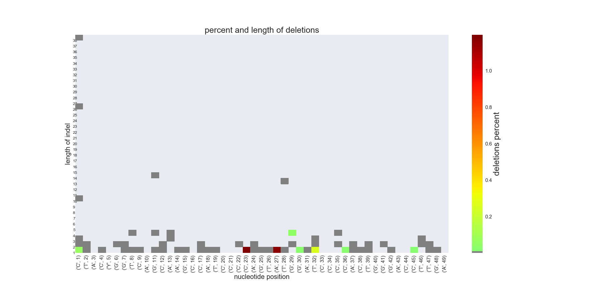

# crispr_cas9
`crispr_cas9` contains in-house scripts that are used for NGS data analysis by HBV crispr/cas9 research group. 

## Installation
```
pip install crispr_cas9
```
## Usage
`crispr_cas9` is intended to be used in Jupyter Notebook. Create folder named `input_data` and put your fastas into it. Navigate into the directory which contains the `input_data` folder. Then import the package :

```python
import crispr_cas9
```
and run :
```python
%run -m crispr_cas9.count_indels
%run -m crispr_cas9.create_matrices
%run -m crispr_cas9.create_plots
```

## Description
This script takes fasta alignment as an input. The input file is the result of deep sequencing reads mapping onto the reference sequence and is imported from the Geneious software.


`count_indels.py` counts exact number of insertions and deletions. The script saves excel spreadsheets containing the raw count.

`create_matrices.py` creates matrices with each entry as the number of indels of length x (row) at position y (column), and saves the matrices as excel spreadsheets.

`create_plots.py` uses the output of the `create_matrices.py` script and constructs bar chart and heatmap

The example of output file. Here are all the deletions found irrespective of their length: 


And heatmap which shows both percent of indels and their lengths:


## Requirements
- Python 3
- Biopython 
- matplotlib
- numpy 
- pandas  
- seaborn 


The script was used to process sequence data for the work by Kostyushev et al.(2019) [1].

**reference:**
1. Orthologous CRISPR/Cas9 systems for specific and efficient degradation of covalently closed
circular DNA of hepatitis B virus. Dmitry Kostyushev, Sergey Brezgin, Anastasiya Kostyusheva, Dmitry Zarifyan, Irina
Goptar, Vladimir Chulanov. Cellular and Molecular Life Sciences (accepted)
