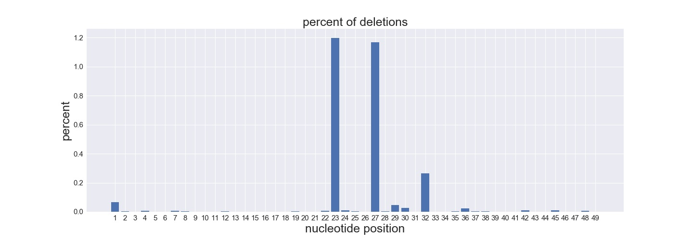

scripts to process the data for guys from research group dealing with crispr/cas9 

'count_indels.py' counts exact number of insertions and deletions in fasta file which is the result of reads mapping onto the reference sequence. It creates xlsx spreadsheets with the raw count.
'create_plots.py' uses the output of the 'count_indels.py' script and makes plots and spreadsheets containg the percentage of eash indel and its position according to the reference sequence

the example of deletions percentage calculating irrespective of their length:

